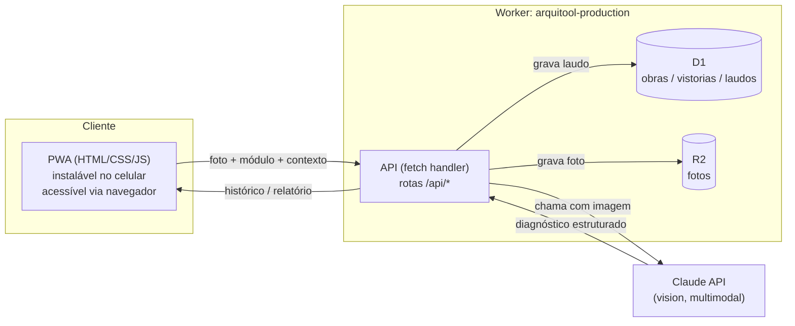

# Arquitetura — Arquitool Production

Complementa o [PRD.md](PRD.md). Define como o app é construído tecnicamente:
stack, componentes, modelo de dados, contratos de API e fluxo de deploy.

## 1. Decisão de stack

Backend em **Cloudflare Workers + D1 (SQL serverless) + R2 (object storage)**,
em vez de uma API Python separada. Motivo: o repo já publica tudo via Cloudflare
(`wrangler.toml` na raiz, projeto `mage`, hoje só assets estáticos) — usar Workers
mantém a mesma plataforma, sem servidor adicional para manter/pagar. O custo é
escrever o backend em TypeScript em vez de Python (diferente do padrão dos outros
projetos de IA do repo, que são Python) — trade-off aceito conscientemente.

**Importante — isto é um Worker próprio, não o site estático da raiz.** O
`wrangler.toml` da raiz do repo (`name = "mage"`) serve só arquivos estáticos e
não muda. Este projeto ganha seu **próprio** `wrangler.toml` dentro de
`publicado/arquitool-production/`, como um Worker separado com:
- `[assets]` apontando para a pasta do frontend (PWA) — serve HTML/CSS/JS/manifest;
- binding de D1 (banco);
- binding de R2 (fotos);
- `fetch handler` com as rotas de API.

Isso é um deploy independente do site principal do repo. Fica marcado como
pendência de confirmação explícita antes de rodar `wrangler deploy` de verdade
(ver regra do Odin sobre deploy).

## 2. Componentes



## 3. Estrutura de pastas proposta

```
publicado/arquitool-production/
├── PRD.md
├── ARCHITECTURE.md
├── README.md                  # criado quando o MVP estiver rodando
├── wrangler.toml               # config do Worker (D1, R2, assets)
├── schema.sql                  # DDL do D1
├── src/
│   ├── index.ts                # fetch handler, roteamento
│   ├── routes/
│   │   ├── obras.ts            # CRUD de obra
│   │   ├── vistorias.ts        # criar vistoria (upload foto + módulo)
│   │   └── relatorios.ts       # exportação PDF por obra/período
│   ├── analyzers/
│   │   ├── base.ts             # contrato comum: foto + contexto -> laudo
│   │   ├── patologias.ts       # prompt módulo 1
│   │   ├── progresso.ts        # prompt módulo 2
│   │   ├── acabamento.ts       # prompt módulo 3
│   │   └── instalacoes.ts      # prompt módulo 4
│   └── db/
│       └── queries.ts
├── public/                     # PWA: assets estáticos servidos pelo Worker
│   ├── index.html
│   ├── manifest.json
│   ├── service-worker.js
│   ├── css/
│   └── js/
└── tests/
```

## 4. Modelo de dados (D1 / SQL)

```sql
CREATE TABLE obra (
  id TEXT PRIMARY KEY,
  nome TEXT NOT NULL,
  endereco TEXT,
  criada_em TEXT NOT NULL DEFAULT (datetime('now'))
);

CREATE TABLE vistoria (
  id TEXT PRIMARY KEY,
  obra_id TEXT NOT NULL REFERENCES obra(id),
  modulo TEXT NOT NULL CHECK (modulo IN ('patologias','progresso','acabamento','instalacoes')),
  foto_key TEXT NOT NULL,          -- chave do objeto no R2
  etapa_esperada TEXT,             -- só usado no módulo 'progresso'
  geolocalizacao TEXT,             -- opcional, "lat,lng"
  criado_em TEXT NOT NULL DEFAULT (datetime('now'))
);

CREATE TABLE laudo (
  id TEXT PRIMARY KEY,
  vistoria_id TEXT NOT NULL REFERENCES vistoria(id),
  severidade TEXT NOT NULL CHECK (severidade IN ('baixa','media','critica')),
  diagnostico TEXT NOT NULL,
  recomendacao TEXT NOT NULL,
  disclaimer TEXT NOT NULL,
  modelo_ia TEXT NOT NULL,
  criado_em TEXT NOT NULL DEFAULT (datetime('now'))
);

CREATE INDEX idx_vistoria_obra ON vistoria(obra_id);
CREATE INDEX idx_laudo_vistoria ON laudo(vistoria_id);
```

## 5. Contrato de API

| Rota | Método | Descrição |
|---|---|---|
| `/api/obras` | `POST` | cria obra (`nome`, `endereco`) |
| `/api/obras` | `GET` | lista obras |
| `/api/obras/:id` | `GET` | detalhe da obra + histórico de vistorias |
| `/api/obras/:id/vistorias` | `POST` | `multipart/form-data`: foto + `modulo` + contexto opcional (`etapa_esperada`, `geolocalizacao`) → grava foto no R2, chama o analyzer do módulo, grava laudo, **retorna o laudo já pronto** na mesma resposta (síncrono — MVP não precisa de fila) |
| `/api/vistorias/:id` | `GET` | detalhe de uma vistoria + laudo |
| `/api/obras/:id/relatorio` | `GET` | gera PDF do histórico (todo ou por período via query params `desde`/`ate`) |

Toda resposta de laudo segue o mesmo formato, independente do módulo:

```json
{
  "vistoria_id": "...",
  "modulo": "patologias",
  "severidade": "media",
  "diagnostico": "Mancha de umidade compatível com infiltração ativa...",
  "recomendacao": "Verificar impermeabilização da laje acima antes de repintar.",
  "disclaimer": "Análise assistiva por IA — não substitui laudo de engenheiro/perito.",
  "modelo_ia": "claude-opus-5"
}
```

## 6. Analyzers (um por módulo)

Mesmo contrato para os 4, só muda o prompt (reaproveitando o padrão de
`vigia_obra/vision_analyzer.py`, adaptado de vídeo/múltiplos frames para
**uma foto por chamada**):

```ts
interface AnalyzerInput {
  imageBytes: ArrayBuffer;
  contexto?: { etapaEsperada?: string; };
}

interface AnalyzerOutput {
  severidade: "baixa" | "media" | "critica";
  diagnostico: string;
  recomendacao: string;
}

interface Analyzer {
  modulo: string;
  analyze(input: AnalyzerInput, apiKey: string): Promise<AnalyzerOutput>;
}
```

Cada analyzer é só um prompt especializado + parsing da resposta estruturada do
Claude (usar saída em JSON/tool use para evitar parsing frágil de texto livre).
Modelo e nível de esforço configuráveis via variável de ambiente do Worker, não
hardcoded — mesmo padrão do `vigia-obra-seguranca`.

## 7. PWA (frontend)

- `manifest.json`: nome, ícone, `display: standalone`, `start_url`.
- `service-worker.js`: cache do shell do app (HTML/CSS/JS) para abrir rápido;
  **não** cacheia respostas da API (laudo sempre busca fresco).
- Captura de foto: `<input type="file" accept="image/*" capture="environment">`
  — funciona tanto no celular (abre câmera direto) quanto no desktop (abre
  seletor de arquivo).
- Sem framework pesado (consistente com o resto do repo) — JS puro ou, se a
  complexidade de estado justificar (histórico, múltiplas telas), avaliar um
  framework leve nessa fase, sem comprometer o "sem build step" como padrão
  inicial.

## 8. Autenticação (MVP)

Login simples por senha única (variável de ambiente / secret do Worker) — sem
cadastro de múltiplos usuários nem SSO no MVP. Suficiente porque o uso é
individual pelo gestor da obra. Documentar como limite do MVP no README quando o
app estiver pronto.

## 9. Custos e limites (Cloudflare)

- D1 e R2 têm free tier generoso para uso de um usuário único — não deve ser
  problema no MVP.
- Custo real relevante é a chamada à Claude API por foto analisada — expor
  modelo mais barato como opção (mesmo padrão do `vigia-obra-seguranca`).

## 10. Próximos passos

1. Confirmar este desenho com o usuário (stack já validada: Workers + D1 + R2).
2. Criar `wrangler.toml` do projeto + `schema.sql` + aplicar migração no D1.
3. Implementar o analyzer do módulo de patologias construtivas primeiro (prompt
   + rota `/api/obras/:id/vistorias` + PWA mínima com 1 tela: foto → laudo).
4. Rodar localmente (`wrangler dev`) e validar antes de cogitar deploy real.
